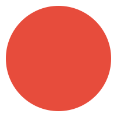
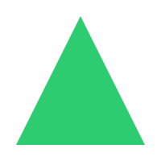

# Lesson 06 — Images

## What you will learn

- The `` element
- The `src` and `alt` attributes
- Relative paths to local images
- External image URLs
- Basic `width` and `height`

---

## The image element

Images are added with ``. It is an **empty element** — no closing tag:

```html

```

Two attributes are essential:

- `src` — the **source**: where the image file is located.
- `alt` — the **alternative text**: a short description of the image.

### Why `alt` matters

`alt` text is shown when the image cannot load, and it is what screen readers
announce to visually impaired visitors. It also helps search engines
understand the image. Write a description of *what the image shows*:

```html

```

> If an image is purely decorative and carries no information, `alt=""`
> (empty) is acceptable. Never leave `alt` out entirely.

## Relative paths (your own images)

If the image lives in the same folder as your page:

```html

```

If it lives in an `images` subfolder:

```html

```

In this lesson's folder there is an `images` folder with three SVG images.
SVG files are vector images stored as text — perfect for simple placeholders:

```html

```

## External image URLs

You can also use an image from another website with an absolute URL:

```html

```

> External images depend on that website staying online. For pages that must
> always work (like your final project), local images are safer.

## Width and height

You can set the size with the `width` and `height` attributes (in pixels):

```html

```

Keep both dimensions in proportion, or the image will look stretched.

## Complete example

```html
<h1>My gallery</h1>



```

## Common mistakes

- **Missing `alt`** — every `` should have an `alt` description.
- **Wrong `src` path** — check the folder structure. `images/photo.jpg` is not
  the same as `photo.jpg`.
- **Typos in file names** — `photo.jpj` will not load.
- **Forgetting it is an empty element** — `</img>` is wrong; just write
  ``.
- **Writing a closing tag** — there is none. A slash before `>` like
  `` is optional and you can ignore it.

## Recap

- `` adds an image; it has no closing tag.
- `src` is the image location; `alt` is the text description.
- Use **relative paths** (`images/photo.jpg`) for local images.
- Use **absolute URLs** (`https://...`) for external images.
- `width` and `height` (in pixels) control the displayed size.

## What's next?

[Lesson 07](../07-lists/README.md) shows how to organize content with bulleted
and numbered lists.
